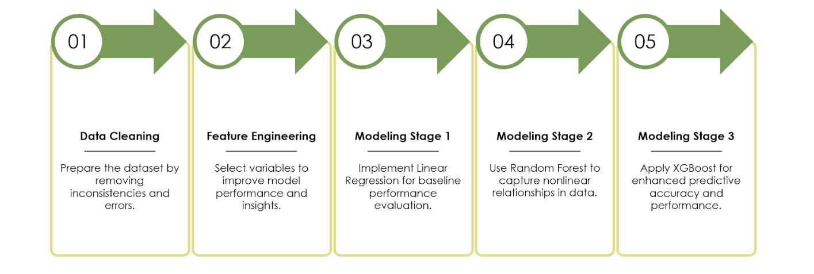
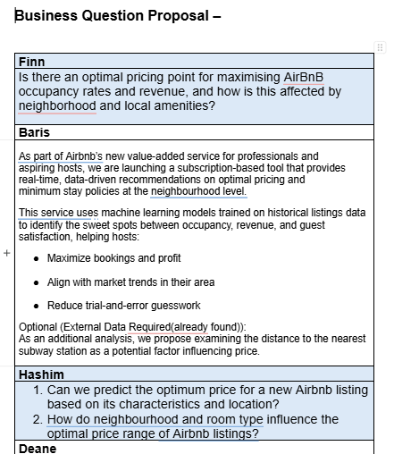

# Module Artefacts Showcase

This page presents a curated collection of artefacts from my work throughout this module. Each piece is selected to demonstrate a specific skill, learning outcome, or contribution to my projects.

---

### Artefact: Project Workflow

**Context and Significance:** This diagram illustrates the systematic, end-to-end workflow that we followed for our team machine learning (AirBNB)project. This structured approach, inspired by industry-standard methodologies.It begins with foundational data preparation before moving to iterative modeling stages. This was a deliberate choice to ensure our conclusions were robust and well-founded, rather than taking a less structured, ad-hoc approach. This methodology demonstrates not just technical planning but also a commitment to a professional and reproducible process, reflecting a commitment to rigorous, comparative evaluation.

---

### Artefact: Price Distribution Analysis

**Context and Significance:** This histogram was a critical first step in my advance EDA roles in the group project, revealing that the `price` variable is heavily right-skewed. This is a common challenge in real-world datasets.

---

### Artefact: Price by Room Type

**Context and Significance:** For the group project,  I created these box plots to investigate the relationship between the categorical feature `room_type` and the target `price`. The visual confirms a strong hierarchical relationship, proving that `room_type` is a powerful predictive feature. Understanding how to handle such categorical data is a key skill. To prevent the model from assuming a false ordinal relationship (e.g., that 'Private room' is mathematically halfway between 'Shared room' and 'Entire home'), this insight justified the use of one-hot encoding. This technique creates new binary features for each category, allowing the model to learn an independent weight for each, which is a standard best practice.

---

### Artefact: Price by Neighbourhood

**Context and Significance:** This analysis highlights that `neighbourhood_group` is another critical categorical feature, again for group project, with Manhattan showing a significantly higher median price and much larger variance. This work, performed early in the project, directly informed our feature engineering strategy and solidified the importance of location in our model. It demonstrated to the team that any successful model would need to effectively capture this geographical information. This finding was a key talking point in our team meetings, guiding our focus for subsequent, more granular geospatial analysis.

---

### Artefact: Geospatial Price Distribution

**Context and Significance:** This geospatial heatmap provided a granular view of price distribution, revealing specific high-price "hotspots." This sophisticated analysis demonstrates an ability to work with and visualize high-dimensional data (latitude, longitude, price) in an intuitive 2D format. It allowed me to move beyond simple categories like boroughs and see the raw patterns emerge. The clear concentration of high prices in central Manhattan and other pockets provided the foundational insight for creating more advanced, continuous location features, representing a key moment where EDA transitioned into creative feature engineering.

---

### Artefact: Correlation Matrix

**Context and Significance:** I generated this correlation plot to identify potential multicollinearity between predictors and to spot any strong linear relationships with the target variable. The plot's finding of weak linear correlations with price was critical, as it proved that a simple linear model would likely have poor performance on its own. It also highlighted the strong positive correlation between `number_of_reviews` and `reviews_per_month`, indicating redundancy. This guided my decision to select only one of these for inclusion in some models to avoid issues with multicollinearity, which can destabilize coefficient estimates in linear models and make interpretation difficult.

---

### Artefact: Impact of Metro Proximity

**Context and Significance:** This visualization validates the `distance_to_nearest_metro` feature that I engineered by enriching our dataset with external data. It clearly demonstrates that access to public transit is a major driver of value, a key piece of domain knowledge for this problem. The data of the Metro stations we not in the main data set, yet I could fnd in the open data sets of NYC. The plot reveals a distinct non-linear relationship, which I fitted with a LOESS curve to better visualize the trend. This showcases not only my ability to create meaningful new features but also to apply appropriate visualization techniques to uncover and present complex, non-linear patterns that would otherwise be missed.

---

### Artefact: Geospatial Clustering with K-Means

**Context and Significance:** To move beyond broad administrative boundaries, I applied the K-Means clustering algorithm to discuss and brainstomr with my group project teammates. An unsupervised learning technique, to the geospatial coordinates. The goal was to engineer a new, data-driven `location_cluster` feature. The choice of k=5 was made after using the elbow method to find a balance between the number of clusters and the within-cluster sum of squares. This data-driven approach to segmentation created more meaningful "micro-markets" than the predefined boroughs. This demonstrates how unsupervised learning can be leveraged to create powerful features for a supervised learning task.

---

### Artefact: CNN Model Architecture

**Context and Significance:** This artefact details the architecture of the Convolutional Neural Network (CNN) I designed and implemented for the individual project. It demonstrates my practical understanding of deep learning concepts learned in the later units of the module. Each layer was chosen for a specific purpose: `Conv2D` layers act as hierarchical feature detectors, learning to recognize edges, then patterns, then parts of objects. `MaxPooling2D` provides spatial down-sampling and introduces a degree of translational invariance. `Dropout` is a critical regularization technique to prevent overfitting. Finally, the `Dense` layers with `softmax` activation perform the final classification.

---

### Artefact: Model Training Curves

**Context and Significance:** These plots of the model's accuracy and loss over 25 epochs were essential for diagnosing the model's learning behaviour. The steady increase in validation accuracy, closely tracking the training accuracy, alongside a decreasing validation loss, confirms that the model was successfully learning generalizable patterns. The minimal gap between the training and validation curves indicates that my regularization strategies, particularly the 25% and 50% `Dropout` rates chosen, were effective. This analysis also informed when to stop training; observing the validation loss beginning to plateau around epoch 20 suggested that further training would yield diminishing returns.

---

### Artefact: Model Performance (Confusion Matrix)

**Context and Significance:** I generated this confusion matrix for a granular analysis of my model's performance, a critical professional skill. While the overall accuracy was high, this matrix allowed for a deeper dive into specific error patterns. For instance, the model frequently confused 'cat' and 'dog', likely due to similar textures and shapes present in the training images. This actionable insight suggests that future improvements could be made by augmenting the dataset with images that better highlight the distinguishing features of these two classes, or by employing more advanced architectures designed for fine-grained classification.

---

### Artefact: Skill Development in R and ggplot2

**Context and Significance:** This artefact demonstrates my personal development in learning the R programming language for advanced data visualization. Coming from a different programming background, I took the initiative to learn R and its powerful ggplot2 library to produce the professional-quality plots used in my project's analysis. This showcases my ability to independently acquire new technical skills and apply them effectively.

---

### Artefact: Skill Development in Python for Deep Learning

**Context and Significance:** While I had prior Python experience in data analysis, this module was my first opportunity to use AI-specific libraries to build predictive models from scratch. This code shows my ability to translate a theoretical model architecture into functional Python code. This represents a significant step in my development, moving beyond just analyzing data to building and implementing the predictive AI models themselves.

---

### Artefact: Research into Time-Series Validation

**Context and Significance:** For my personal project of creating a trading robot, I researched testing methods suitable for financial time-series data. I learned that standard validation can be misleading in this domain, so I focused on the Walk-Forward Testing methodology shown here. This demonstrates my initiative to research domain-specific challenges, like preventing overfitting, to ensure a model is robust enough for all-wheather real-world application. It is WIP now.

---

### Artefact: Initiating Team Collaboration

**Context and Significance:** This screenshot from our team's group chat shows the practical steps taken to organize our collaboration. My role in this instance was to initiate the move from asynchronous chat to a synchronous meeting environment by creating and sharing a Microsoft Teams link. This demonstrates my proactive approach to facilitating collaboration, which was essential for the "forming" and "storming" stages of our group development. It is direct evidence of my contribution to creating a professional and effective team organization.

---

### Artefact: Collaborative Project Ideation

**Context and Significance:** This artefact is a snapshot of our team's collaborative brainstorming for our project proposal. It showcases the different perspectives each team member brought to the project's initial definition. My specific contribution, under my name "Baris," was to frame the project as a value-added, subscription-based tool for Airbnb hosts. This strategic, business-oriented thinking helped focus our technical goals on a tangible outcome and demonstrates my ability to contribute not just to the "how" (the code), but also to the "why" (the business case) of a project.
