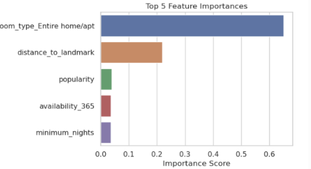

## Evaluation of Project Evolution

Our project underwent a significant evolution from the initial proposal, driven by data-driven insights and a deepening understanding of the business problem. The project's objective matured from a simple price prediction task into a more strategic goal: identifying optimal pricing strategies that balance revenue and occupancy for hosts.

This strategic shift was mirrored in our methodology. We began with a plan to use Linear Regression, however, the initial **Exploratory Data Analysis I conducted** revealed complex, non-linear relationships in the data, a finding I presented to the team. This collaborative analysis confirmed that a simple model would be insufficient, and its subsequent poor performance (MAE of $209) proved this hypothesis (Géron, 2022). This forced a data-driven pivot, leading us to adopt an iterative approach with more robust ensemble methods like Random Forest (MAE=$39.95) and ultimately XGBoost (MAE=$32.17) (Breiman, 2001; Chen & Guestrin, 2016).

The final XGBoost model highlighted the importance of engineered features like distance_to_landmark and the categorical variable room_type_Entire home/apt, as depicted in Figure.

A second critical adaptation was our data strategy. We moved beyond the limitations of the initial dataset by performing data enrichment. This involved sourcing external geospatial data from NYC Open Data and integrating it into our analysis following a rigorous cleaning process (Kang, 2021). This allowed for the engineering of powerful features like `distance_to_metro`, which were instrumental to the final model's success.

Overall, the project's evolution demonstrates a key learning outcome: the importance of agile adaptation. Our success was driven not by rigidly following an initial plan, but by our team's collaborative ability to respond to empirical evidence and challenges, leading to a more robust and valuable final product.
